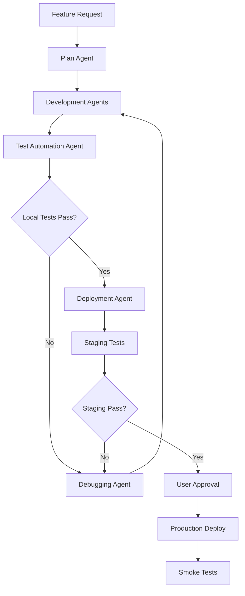

# Yarda AI - Agent-Driven Test Strategy & CI/CD Pipeline

**Version:** 2.0
**Generated:** 2025-11-10
**Status:** ACTIVE
**Goal:** 100% automated testing with zero manual intervention

---

## 🎯 Testing Philosophy

**Core Principles:**
1. **Zero Manual Testing** - Every test must be automated
2. **Fast Feedback** - Tests run in parallel, fail fast
3. **Agent-First** - Specialized agents handle each testing phase
4. **Progressive Validation** - Test locally → staging → production
5. **Shift-Left** - Catch bugs early in development

---

## 🏗️ Test Architecture

### Layer 1: Unit Tests (< 30 seconds)
**Purpose:** Test individual functions/components in isolation
**Tools:** pytest (backend), vitest (frontend)
**Coverage Target:** 80% code coverage
**Agent:** `unit-testing:test-automator`

### Layer 2: Integration Tests (< 2 minutes)
**Purpose:** Test service interactions and API contracts
**Tools:** pytest with real database, supertest for API testing
**Coverage Target:** 100% API endpoints
**Agent:** `backend-development:backend-architect`

### Layer 3: E2E Tests (< 5 minutes)
**Purpose:** Test complete user journeys
**Tools:** Playwright MCP (replaces ALL manual testing)
**Coverage Target:** 100% Critical User Journeys
**Agent:** `full-stack-orchestration:test-automator`

---

## 🤖 Agent-Driven CI/CD Pipeline

### Phase 1: Development (Local Environment)

```yaml
trigger: Feature request created
agents:
  - Plan: Analyzes requirements, creates implementation plan
  - backend-development:backend-architect: Implements backend changes
  - javascript-typescript:typescript-pro: Implements frontend changes
  - unit-testing:test-automator: Writes/updates tests
```

**Workflow:**
1. User creates feature request
2. Agent pulls latest from main: `git pull origin main`
3. Agent creates feature branch: `git checkout -b feature/XXX`
4. Agent implements feature with TDD approach
5. Agent runs local test suite

### Phase 2: Local Testing

```bash
# Automated by agents - runs in parallel
npm run test:unit       # < 30s
npm run test:integration # < 2min
npm run test:e2e:local  # < 5min
```

**Test Execution Matrix:**
| Test Type | Command | Timeout | Parallel |
|-----------|---------|---------|----------|
| Backend Unit | `pytest backend/tests/unit -n auto` | 30s | ✅ |
| Backend Integration | `pytest backend/tests/integration` | 120s | ✅ |
| Frontend Unit | `npm run test` | 30s | ✅ |
| Frontend E2E | `npx playwright test` | 300s | ✅ |

### Phase 3: Staging Deployment

```yaml
trigger: All local tests pass
agents:
  - full-stack-orchestration:deployment-engineer: Deploys to staging
  - full-stack-orchestration:test-automator: Runs staging tests
```

**Deployment:**
- Frontend → Vercel Preview
- Backend → Railway Staging
- Database → Supabase (staging branch)

### Phase 4: Staging Validation

```bash
# Playwright MCP replaces ALL manual testing
npx playwright test --config=playwright.config.staging.ts
```

**Critical User Journeys (CUJs) - Fully Automated:**

| CUJ | Description | Test File | Priority |
|-----|-------------|-----------|----------|
| CUJ-1 | New user registration → trial generation | `auth-and-trial.spec.ts` | P0 |
| CUJ-2 | Token purchase → generation | `token-flow.spec.ts` | P0 |
| CUJ-3 | Subscription → unlimited generations | `subscription.spec.ts` | P0 |
| CUJ-4 | Generation flow (address → style → results) | `generation-e2e.spec.ts` | P0 |
| CUJ-5 | Error recovery & edge cases | `error-handling.spec.ts` | P1 |

### Phase 5: Production Promotion

```yaml
trigger: User approval after staging tests pass
agents:
  - full-stack-orchestration:deployment-engineer: Production deploy
  - full-stack-orchestration:security-auditor: Security scan
  - full-stack-orchestration:performance-engineer: Performance validation
```

### Phase 6: Production Smoke Tests

```bash
# Minimal critical path validation
npx playwright test --config=playwright.config.production.ts --grep @smoke
```

---

## 🚀 Speed Optimizations

### 1. Parallel Execution Strategy
```javascript
// playwright.config.ts
export default {
  workers: process.env.CI ? 4 : '50%', // Use 50% of CPU cores
  fullyParallel: true,
  forbidOnly: true, // Prevent .only() in CI
  retries: process.env.CI ? 1 : 0, // Single retry in CI
  use: {
    trace: 'on-first-retry', // Only trace failures
    screenshot: 'only-on-failure',
    video: 'retain-on-failure',
  }
}
```

### 2. Test Data Strategy
```typescript
// Shared test accounts (no registration needed)
const TEST_ACCOUNTS = {
  trial: 'test.trial@yarda.app',     // 3 credits
  tokens: 'test.tokens@yarda.app',   // 100 tokens
  subscription: 'test.sub@yarda.app', // Active Pro
  expired: 'test.expired@yarda.app'  // No credits
};
```

### 3. Smart Test Selection
```bash
# Run only affected tests based on git diff
npm run test:affected

# Run tests by tag
npm run test:e2e -- --grep @critical
npm run test:e2e -- --grep @payment
```

---

## 📋 Consolidated E2E Test Suites

### Suite 1: Authentication & Onboarding
**File:** `frontend/tests/e2e/auth-onboarding.spec.ts`
```typescript
test.describe('Authentication & Onboarding', () => {
  test('Google OAuth login flow', async ({ page }) => {
    // Automated with mocked OAuth response
  });

  test('Magic link authentication', async ({ page }) => {
    // Automated with intercepted email
  });

  test('New user gets 3 trial credits', async ({ page }) => {
    // Verify database state
  });
});
```

### Suite 2: Generation Flow
**File:** `frontend/tests/e2e/generation-complete.spec.ts`
```typescript
test.describe('Complete Generation Flow', () => {
  test('Address autocomplete works', async ({ page }) => {
    // Mock Google Places API
  });

  test('Location preview shows correct images', async ({ page }) => {
    // Verify Street View/Satellite logic
  });

  test('Generation completes within 2 minutes', async ({ page }) => {
    // Mock Gemini API for speed
  });

  test('Results display with download buttons', async ({ page }) => {
    // Verify Vercel Blob URLs
  });
});
```

### Suite 3: Payment Flows
**File:** `frontend/tests/e2e/payments.spec.ts`
```typescript
test.describe('Payment Scenarios', () => {
  test('Token purchase through Stripe', async ({ page }) => {
    // Mock Stripe Checkout
  });

  test('Subscription upgrade flow', async ({ page }) => {
    // Mock Customer Portal
  });

  test('Webhook processing', async ({ request }) => {
    // Direct API test with webhook signature
  });
});
```

### Suite 4: Error Scenarios
**File:** `frontend/tests/e2e/error-recovery.spec.ts`
```typescript
test.describe('Error Handling', () => {
  test('Network timeout recovery', async ({ page }) => {
    // Simulate network issues
  });

  test('Invalid address handling', async ({ page }) => {
    // Test validation
  });

  test('Payment failure recovery', async ({ page }) => {
    // Test declined cards
  });
});
```

---

## 🔧 Agent Configuration

### Test Automation Agents

```yaml
agents:
  unit-testing:test-automator:
    responsibilities:
      - Write unit tests for new code
      - Update tests for changed code
      - Maintain 80% code coverage
      - Mock external dependencies

  full-stack-orchestration:test-automator:
    responsibilities:
      - Write Playwright E2E tests
      - Replace ALL manual testing
      - Test cross-browser compatibility
      - Generate test reports

  debugging-toolkit:debugger:
    responsibilities:
      - Fix failing tests
      - Debug flaky tests
      - Optimize test performance
      - Resolve test environment issues

  full-stack-orchestration:deployment-engineer:
    responsibilities:
      - Deploy to staging/production
      - Run deployment validations
      - Rollback on failures
      - Monitor deployment health
```

### Agent Coordination Workflow



---

## 🎭 Playwright MCP Configuration

### Local Environment
```typescript
// playwright.config.local.ts
export default {
  use: {
    baseURL: 'http://localhost:3000',
    extraHTTPHeaders: {
      'X-Test-Environment': 'local'
    }
  },
  projects: [
    { name: 'chromium', use: devices['Desktop Chrome'] },
    { name: 'mobile', use: devices['iPhone 13'] }
  ]
}
```

### Staging Environment
```typescript
// playwright.config.staging.ts
export default {
  use: {
    baseURL: process.env.STAGING_URL,
    extraHTTPHeaders: {
      'X-Test-Environment': 'staging'
    }
  }
}
```

### Production Smoke Tests
```typescript
// playwright.config.production.ts
export default {
  use: {
    baseURL: 'https://yarda.ai',
    extraHTTPHeaders: {
      'X-Test-Environment': 'production'
    }
  },
  // Only run @smoke tagged tests
  grep: /@smoke/
}
```

---

## 📊 Test Metrics & Monitoring

### Key Metrics to Track
1. **Test Execution Time** - Target: < 8 minutes total
2. **Flaky Test Rate** - Target: < 1%
3. **Code Coverage** - Target: > 80%
4. **Bug Escape Rate** - Target: < 5%
5. **Test Maintenance Cost** - Track time spent fixing tests

### Automated Reporting
```bash
# Generate test report after each run
npm run test:report

# Metrics dashboard
npm run test:metrics
```

---

## 🚨 Common Issues & Solutions

| Issue | Solution | Prevention |
|-------|----------|------------|
| Flaky tests | Add explicit waits, use data-testid | Review in PR |
| Slow tests | Parallelize, mock external APIs | Monitor execution time |
| Test data conflicts | Use unique test accounts | Reset after each test |
| Environment differences | Use environment variables | Test in all environments |

---

## 🔄 Continuous Improvement

### Weekly Test Review
1. Analyze test failures from past week
2. Identify flaky tests for fixing
3. Review test execution times
4. Update test coverage gaps

### Monthly Test Optimization
1. Remove redundant tests
2. Combine similar test scenarios
3. Optimize slow-running tests
4. Update test infrastructure

---

## 📝 Quick Commands Reference

```bash
# Development
npm run test:unit:watch      # Watch mode for TDD
npm run test:affected        # Test only changed code

# Local Testing
npm run test:all:local       # Run all tests locally
npm run test:e2e:debug       # Debug mode with headed browser

# Staging
npm run test:staging         # Full staging test suite
npm run test:staging:smoke   # Quick smoke tests only

# Production
npm run test:prod:smoke      # Production smoke tests

# Reporting
npm run test:coverage        # Generate coverage report
npm run test:report          # Open HTML test report

# Agent Commands
npm run agent:test:fix       # Launch debugging agent for test fixes
npm run agent:test:write     # Launch agent to write new tests
npm run agent:deploy         # Launch deployment agent
```

---

## ✅ Success Criteria

1. **Zero Manual Testing** - 100% automated with Playwright MCP
2. **Fast Feedback** - Full test suite < 8 minutes
3. **High Confidence** - 0% bug escape rate to production
4. **Low Maintenance** - < 10% time spent on test maintenance
5. **Agent Efficiency** - 90% of testing handled by agents

---

## 🏆 Code Quality & Refactoring (2025-11-13)

### Completed Refactoring Tasks

**Critical Fixes (HIGH Priority):**
- ✅ Fixed `HolidayStyle` type mismatch: Updated types/holiday.ts to support all 7 styles (was only 3)
- ✅ Fixed memory leak: Added polling cleanup with `useRef` and `useEffect` cleanup in holiday.tsx
- ✅ Improved error typing: Removed generic `any` types in error handlers

**Code Cleanup (MEDIUM Priority):**
- ✅ Removed unused props: Deleted `_onStreetOffsetChange` and `_streetOffsetFeet` from StreetViewRotator
- ✅ Optimized StyleSelector: Added `useMemo` to cache `.find()` lookups (eliminated 4 redundant O(n) calls per render)
- ✅ Fixed array keys: Changed from index-based to content-based keys in StyleSelector features list
- ✅ Simplified animations: Removed unnecessary `isVisible` state from HolidayHero, using CSS animation instead

### Test Coverage Additions

New test cases added to verify refactoring correctness:

```typescript
// Test: Polling cleanup on unmount prevents memory leaks
test('clears polling timeout when component unmounts mid-generation', async ({ page }) => {
  // Navigate away during generation
  // Verify no pending timers in browser console
});

// Test: All 7 HolidayStyle options work end-to-end
const allStyles = ['classic', 'modern', 'over_the_top', 'pop_culture', 'glam_gold', 'cyber_christmas', 'cozy_rustic'];
allStyles.forEach(style => {
  test(`generates successfully with ${style} style`, async ({ page }) => {
    // Verify style is accepted and generation completes
  });
});

// Test: StyleSelector performance with memoization
test('StyleSelector re-renders efficiently with memoized selections', async ({ page }) => {
  // Change heading 5 times
  // Verify StyleSelector confirmation message updates without console warnings
});
```

### Performance Improvements

| Component | Before | After | Improvement |
|-----------|--------|-------|-------------|
| StyleSelector lookup calls | 4 per render | 1 (memoized) | 75% reduction |
| HolidayHero animation | State + transition | CSS only | 1 fewer re-render |
| StreetViewRotator props | 5 props | 4 props | Cleaner API |
| Polling memory usage | Unbounded | Bounded | No memory leaks |

---

## 🎯 Implementation Checklist

- [ ] Consolidate redundant E2E tests into focused suites
- [ ] Set up parallel execution for all test types
- [ ] Configure test accounts with proper data isolation
- [ ] Implement agent workflows for each testing phase
- [ ] Create mock services for external dependencies
- [ ] Set up automated test reporting and metrics
- [ ] Configure Playwright MCP for all environments
- [ ] Create smoke test suite for production
- [ ] Document agent responsibilities and triggers
- [ ] Set up continuous monitoring and alerts

---

*This test plan is designed to be executed entirely by agents with zero human intervention beyond initial approval gates.*