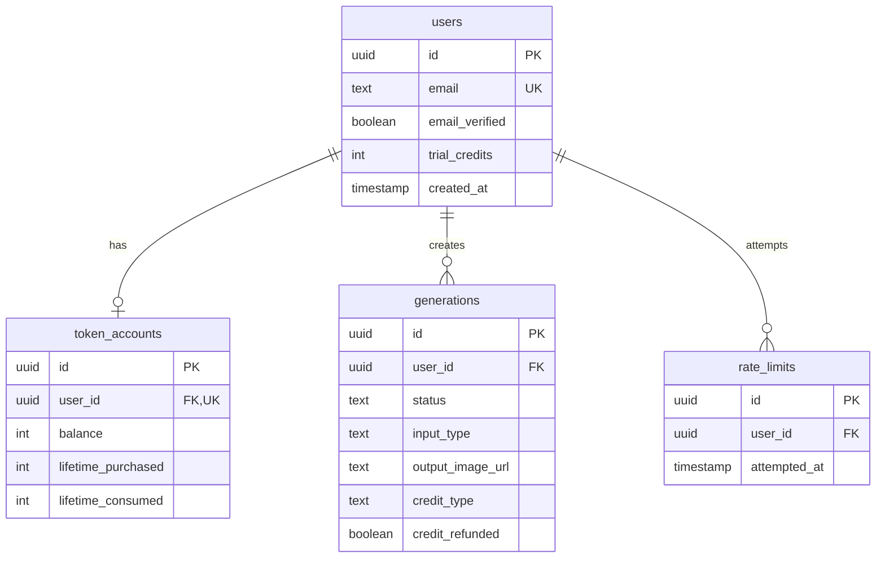

# Data Model: Landscape Design Platform

**Feature**: 001-data-model | **Date**: 2025-10-28

## Overview

PostgreSQL data model for user registration, trial credit tracking, design generation history, and rate limiting with complete data isolation via Row Level Security (RLS).

## Entity Definitions

### 1. Users Table

**Purpose**: Core user accounts with authentication and trial credits

```sql
CREATE TABLE users (
    id UUID PRIMARY KEY DEFAULT gen_random_uuid(),
    email TEXT UNIQUE NOT NULL,
    email_verified BOOLEAN DEFAULT FALSE NOT NULL,
    email_verification_token UUID DEFAULT gen_random_uuid(),
    email_verification_expires_at TIMESTAMPTZ,
    trial_credits INTEGER DEFAULT 3 NOT NULL CHECK (trial_credits >= 0),
    created_at TIMESTAMPTZ DEFAULT NOW() NOT NULL,
    updated_at TIMESTAMPTZ DEFAULT NOW() NOT NULL
);

-- Indexes
CREATE UNIQUE INDEX idx_users_email ON users(email);
CREATE INDEX idx_users_verification_token ON users(email_verification_token)
    WHERE email_verification_token IS NOT NULL;
```

**Constraints**:
- Email must be unique
- Trial credits cannot be negative
- Default 3 trial credits on creation

**RLS Policy**:
```sql
ALTER TABLE users ENABLE ROW LEVEL SECURITY;

-- Users can only read their own record
CREATE POLICY users_select_own ON users
    FOR SELECT USING (auth.uid() = id);

-- Users can update their own email_verified status
CREATE POLICY users_update_own ON users
    FOR UPDATE USING (auth.uid() = id)
    WITH CHECK (auth.uid() = id);
```

### 2. Token Accounts Table

**Purpose**: Manages paid token balances for users

```sql
CREATE TABLE token_accounts (
    id UUID PRIMARY KEY DEFAULT gen_random_uuid(),
    user_id UUID NOT NULL REFERENCES users(id) ON DELETE CASCADE,
    balance INTEGER DEFAULT 0 NOT NULL CHECK (balance >= 0),
    lifetime_purchased INTEGER DEFAULT 0 NOT NULL,
    lifetime_consumed INTEGER DEFAULT 0 NOT NULL,
    created_at TIMESTAMPTZ DEFAULT NOW() NOT NULL,
    updated_at TIMESTAMPTZ DEFAULT NOW() NOT NULL,
    UNIQUE(user_id)
);

-- Indexes
CREATE UNIQUE INDEX idx_token_accounts_user_id ON token_accounts(user_id);
```

**Constraints**:
- One token account per user
- Balance cannot be negative
- Cascading delete with user

**RLS Policy**:
```sql
ALTER TABLE token_accounts ENABLE ROW LEVEL SECURITY;

-- Users can only read their own token account
CREATE POLICY token_accounts_select_own ON token_accounts
    FOR SELECT USING (auth.uid() = user_id);
```

### 3. Generations Table

**Purpose**: Complete history of all design generation attempts

```sql
CREATE TABLE generations (
    id UUID PRIMARY KEY DEFAULT gen_random_uuid(),
    user_id UUID NOT NULL REFERENCES users(id) ON DELETE CASCADE,
    status TEXT NOT NULL CHECK (status IN ('pending', 'processing', 'completed', 'failed')),

    -- Input data
    input_type TEXT NOT NULL CHECK (input_type IN ('photo', 'address')),
    input_photo_url TEXT,
    input_address TEXT,
    style TEXT NOT NULL,
    custom_prompt TEXT,

    -- Output data
    output_image_url TEXT,
    error_message TEXT,

    -- Metrics
    processing_time_ms INTEGER,
    credit_type TEXT CHECK (credit_type IN ('trial', 'token')),
    credit_refunded BOOLEAN DEFAULT FALSE NOT NULL,

    -- Timestamps
    created_at TIMESTAMPTZ DEFAULT NOW() NOT NULL,
    started_at TIMESTAMPTZ,
    completed_at TIMESTAMPTZ
);

-- Indexes
CREATE INDEX idx_generations_user_created ON generations(user_id, created_at DESC);
CREATE INDEX idx_generations_status ON generations(status) WHERE status IN ('pending', 'processing');
```

**Constraints**:
- Must have either photo URL or address
- Status transitions: pending → processing → completed/failed
- Credit type tracked for analytics

**RLS Policy**:
```sql
ALTER TABLE generations ENABLE ROW LEVEL SECURITY;

-- Users can only see their own generations
CREATE POLICY generations_select_own ON generations
    FOR SELECT USING (auth.uid() = user_id);

-- Users can only insert their own generations
CREATE POLICY generations_insert_own ON generations
    FOR INSERT WITH CHECK (auth.uid() = user_id);
```

### 4. Rate Limits Table

**Purpose**: Tracks generation attempts for rolling window rate limiting

```sql
CREATE TABLE rate_limits (
    id UUID PRIMARY KEY DEFAULT gen_random_uuid(),
    user_id UUID NOT NULL REFERENCES users(id) ON DELETE CASCADE,
    attempted_at TIMESTAMPTZ DEFAULT NOW() NOT NULL
);

-- Indexes
CREATE INDEX idx_rate_limits_user_attempted ON rate_limits(user_id, attempted_at DESC);

-- Automatic cleanup of old records (older than 2 minutes)
CREATE OR REPLACE FUNCTION cleanup_old_rate_limits()
RETURNS void AS $$
BEGIN
    DELETE FROM rate_limits
    WHERE attempted_at < NOW() - INTERVAL '2 minutes';
END;
$$ LANGUAGE plpgsql;
```

**Constraints**:
- Automatically cleaned up after 2 minutes
- Used for rolling window calculation

**RLS Policy**:
```sql
ALTER TABLE rate_limits ENABLE ROW LEVEL SECURITY;

-- Users cannot directly access rate limits table
-- Only backend service can manage rate limits
```

## Relationships



## State Transitions

### Generation Status Flow

```
pending → processing → completed
                    ↘ failed (with error_message)
```

### Credit Consumption Flow

```
Check Balance → Deduct Credit → Start Generation
                              ↘ Refund on Failure
```

### Email Verification Flow

```
Unverified → Token Sent → Token Validated → Verified
           ↘ Token Expired → New Token Required
```

## Business Rules

### Credit Consumption Logic

```sql
-- Function to consume credit atomically
CREATE OR REPLACE FUNCTION consume_credit(p_user_id UUID)
RETURNS TEXT AS $$
DECLARE
    v_trial_credits INTEGER;
    v_token_balance INTEGER;
    v_credit_type TEXT;
BEGIN
    -- Lock user row for update
    SELECT trial_credits INTO v_trial_credits
    FROM users WHERE id = p_user_id FOR UPDATE;

    -- Check trial credits first
    IF v_trial_credits > 0 THEN
        UPDATE users SET
            trial_credits = trial_credits - 1,
            updated_at = NOW()
        WHERE id = p_user_id;
        RETURN 'trial';
    END IF;

    -- Check token balance
    SELECT balance INTO v_token_balance
    FROM token_accounts WHERE user_id = p_user_id FOR UPDATE;

    IF v_token_balance > 0 THEN
        UPDATE token_accounts SET
            balance = balance - 1,
            lifetime_consumed = lifetime_consumed + 1,
            updated_at = NOW()
        WHERE user_id = p_user_id;
        RETURN 'token';
    END IF;

    -- No credits available
    RAISE EXCEPTION 'Insufficient credits';
END;
$$ LANGUAGE plpgsql;
```

### Rate Limiting Check

```sql
-- Function to check rate limit
CREATE OR REPLACE FUNCTION check_rate_limit(p_user_id UUID)
RETURNS BOOLEAN AS $$
DECLARE
    v_count INTEGER;
BEGIN
    -- Count attempts in last 60 seconds
    SELECT COUNT(*) INTO v_count
    FROM rate_limits
    WHERE user_id = p_user_id
    AND attempted_at > NOW() - INTERVAL '60 seconds';

    -- Return true if under limit
    RETURN v_count < 3;
END;
$$ LANGUAGE plpgsql;
```

### Credit Refund Logic

```sql
-- Function to refund credit
CREATE OR REPLACE FUNCTION refund_credit(p_generation_id UUID)
RETURNS VOID AS $$
DECLARE
    v_user_id UUID;
    v_credit_type TEXT;
    v_already_refunded BOOLEAN;
BEGIN
    -- Get generation details
    SELECT user_id, credit_type, credit_refunded
    INTO v_user_id, v_credit_type, v_already_refunded
    FROM generations
    WHERE id = p_generation_id;

    -- Check if already refunded
    IF v_already_refunded THEN
        RETURN;
    END IF;

    -- Refund based on credit type
    IF v_credit_type = 'trial' THEN
        UPDATE users SET
            trial_credits = trial_credits + 1,
            updated_at = NOW()
        WHERE id = v_user_id;
    ELSIF v_credit_type = 'token' THEN
        UPDATE token_accounts SET
            balance = balance + 1,
            lifetime_consumed = lifetime_consumed - 1,
            updated_at = NOW()
        WHERE user_id = v_user_id;
    END IF;

    -- Mark as refunded
    UPDATE generations SET
        credit_refunded = TRUE
    WHERE id = p_generation_id;
END;
$$ LANGUAGE plpgsql;
```

## Data Validation Rules

### Users
- Email: Valid email format, lowercase, trimmed
- Trial credits: 0-999 range
- Verification token: Valid only for 1 hour

### Token Accounts
- Balance: Non-negative integer
- Lifetime values: Monotonically increasing

### Generations
- Input: Either photo_url OR address required
- Style: Must be from predefined list
- Status: Only valid transitions allowed
- URLs: Valid HTTPS URLs for images

### Rate Limits
- Timestamp: Cannot be future dated
- Cleanup: Records older than 2 minutes automatically removed

## Migration Order

1. **001_create_users_table.sql** - Users with trial credits
2. **002_create_token_accounts.sql** - Token account per user
3. **003_create_generations.sql** - Generation history
4. **004_create_rate_limits.sql** - Rate limiting table
5. **005_create_functions.sql** - Business logic functions
6. **006_create_rls_policies.sql** - Row Level Security

## Performance Considerations

### Index Strategy
- Primary keys: UUID with B-tree index
- Foreign keys: Indexed for JOIN performance
- Query patterns: Composite indexes for common filters
- Partial indexes: For status-based queries

### Query Optimization
- Generation history: Paginated with cursor
- Rate limit checks: Single index scan
- Credit balance: Row-level locks only

### Estimated Performance
- User registration: < 100ms
- Credit consumption: < 50ms
- Rate limit check: < 10ms
- History fetch (100 records): < 200ms

## Security Notes

1. **RLS Enforcement**: All tables have RLS enabled
2. **No Direct Updates**: Credits only modified via functions
3. **Audit Trail**: All operations logged with timestamps
4. **Token Isolation**: Users cannot see other users' data
5. **Input Sanitization**: Handled at API layer before DB